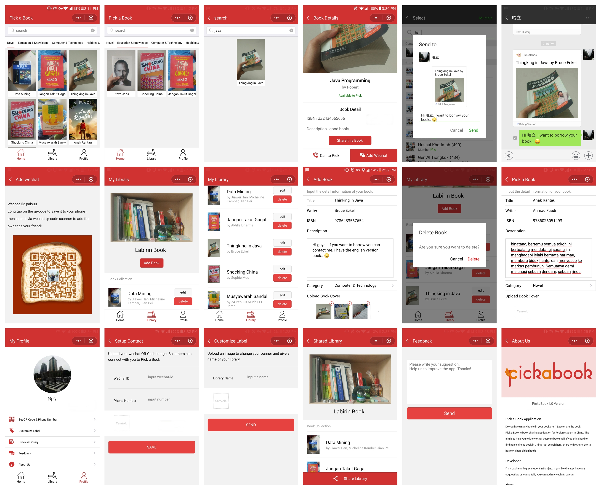

# pickabook-wechat-mini-app

A wechat mini app to help international students in china in sharing book activity..
The app runs in wechat as a mini program and connects international students who looking for non-chinese book by borrow and lending with each other.
It uses wechat qrcode to connect the borrower and owner.
Book owner uploads his book to the mini app then other people can connect to him using the qrcode.

## Installing / Getting started
To run the project you will need wechat devtools

### Prerequisites
You must atleast have wechat devtools installed

## Developing
To develop the app you will need to connect to the backend of the api. A restful api written in nodejs here is the backend [backend](https://github.com/labirin/pickabook-api)### Built With
Javascript, wechat's own mockup language

## App Preview

Scan with wechat scanner to open the application with qr-code
